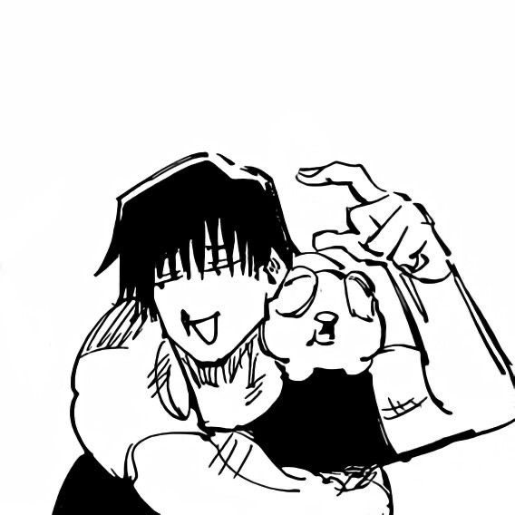
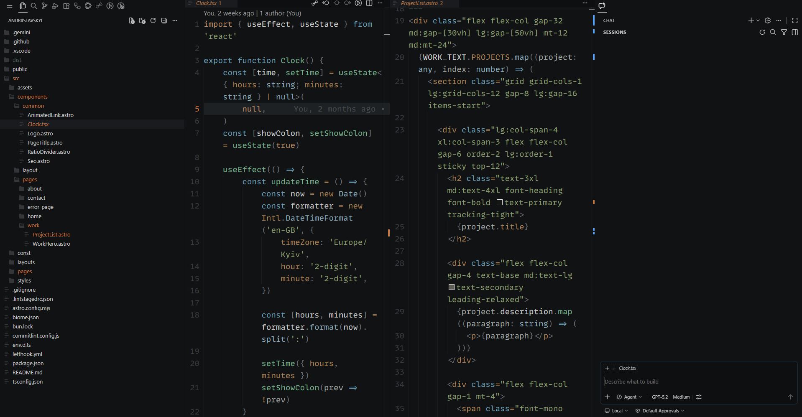
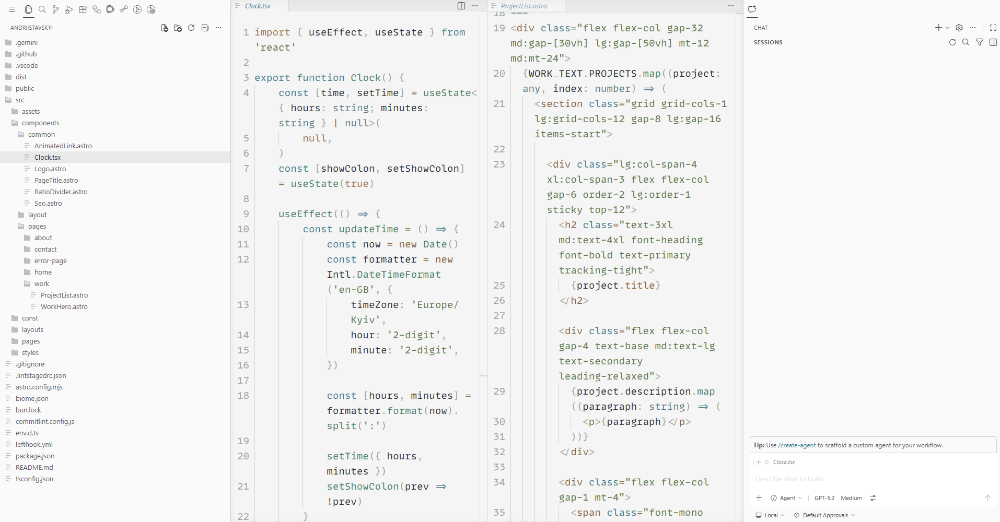

<h1>Toji Fushiguro - VS Code Theme</h1>

Inspired by the Sorcerer Killer - no Cursed Energy, just raw technique.

---

A minimalist VS Code color theme built around the aesthetic of **Toji Fushiguro** from *Jujutsu Kaisen*. Designed for prolonged focus, it abandons distracting neon colors in favor of a muted, pragmatic palette.

The extension is available in [Visual Studio Marketplace](https://marketplace.visualstudio.com/items?itemName=Kossman.toji-fushiguro-theme)

<h3>Dark</h3>

<h3>Light</h3>

## License

This theme is licensed under the [MIT License](LICENSE).

Inspired by <a href="https://jujutsu-kaisen.fandom.com/wiki/Toji_Fushiguro">Toji Fushiguro</a> from Jujutsu Kaisen

